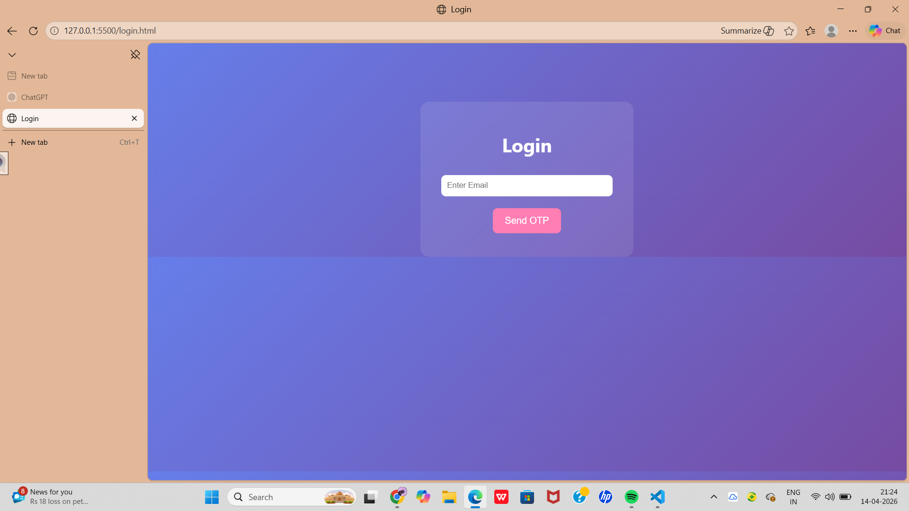
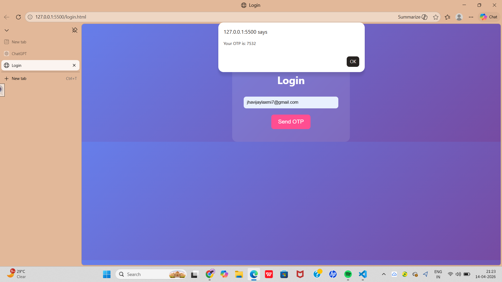
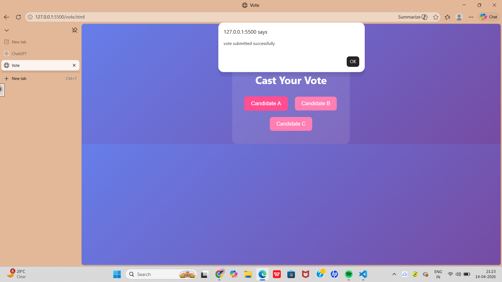
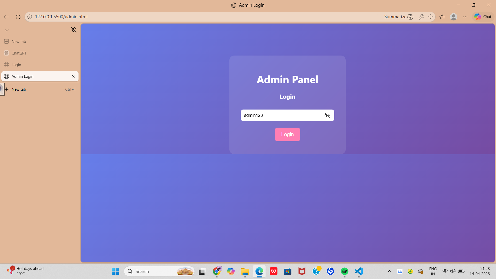
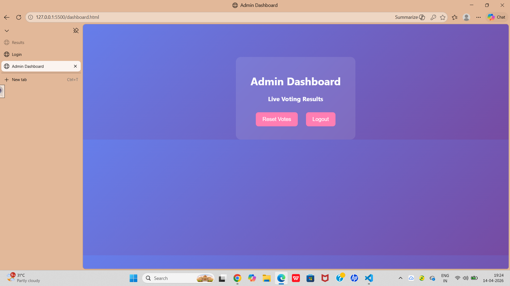

# Online Voting System

## Description
A simple web-based voting system where users can vote for candidates.

## Features
- Vote for candidates
- Real-time vote update
- Backend using Flask

## Technologies Used
- HTML, CSS, JavaScript
- Python (Flask)

## How to Run
1. Install Flask: pip install flask
2. Run app.py
3. Open index.html in browser

# 📸 Screenshots

## 🔐 Login Page

## 📩 OTP Verification

## 🗳️ Voting Page

## 👨‍💻 Admin Panel

## 📊 Dashboard Page

## Author
Vijaylaxmi
